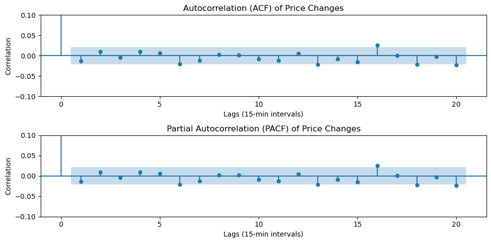
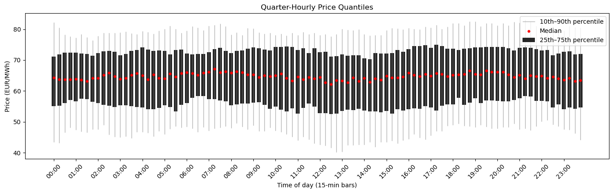

# Backtest Audit — Review

## Recommendation

**Do not go live.** The reported 6.14 Sharpe and 9035% return are driven by statistical errors that leak future information into the signal. While a corrected variant using time-of-day normalization achieves a +5.39 out-of-sample Sharpe (+94 EUR/MWh), this is based on only 125 trades across a single 30-day test window without exogenous market predictors. This is insufficient statistical evidence to directly allocate capital.

---

## Findings (Ordered by Severity)

### Fatal: Look-Ahead in the Rolling Window

`build_features`, line 33–34.

`rolling(16, center=True)` computes the moving average at time $t$ using prices from $t-7$ through $t+8$. Those prices do not exist at decision time. The z-score becomes smoother and more predictive because it already knows where the price is going.

**Fix**: `center=False`, `min_periods=WINDOW`.

**Impact**: This changes the optimal threshold from 0.40 to 1.00, but the Sharpe stays at 7.13 as this is only the first fix.

```
Step 0 -> Step 1: Sharpe 6.14 -> 7.13, switches 3822 -> 2306
```

---

### Fatal: Execution Time Travel

`run_backtest`, line 55.

`strat_ret = position * ret` multiplies the position at time $t$ by the return from $t-1$ to $t$. The position is derived from the price at $t$, so the strategy observes a 15-minute move and enters at the start of that time period. In practice, a signal formed at $t$ can only earn the return from $t$ to $t+1$.

**Fix**: `position.shift(1) * ret`.

**Impact**: This is the largest contributor to the inflated performance. Once the position is lagged by one bar, the Sharpe drops from 7.13 to 0.23. 

```
Step 1 -> Step 2: Sharpe 7.13 -> 0.23, return 8697% -> 115%, switches 2306 -> 704
```

---

### Fatal: In-Sample Overfitting

`optimize_threshold` and `main`, lines 67–84.

The code tests 24 threshold values over the entire 90-day sample and reports the best one. Optimising and evaluating on the same data is not statistically sound. This also addresses the **selection bias** from running 24 trials: picking the maximum Sharpe from 24 candidates inflates expected performance ($E[\max] > E[\text{single trial}]$). A proper train/test split makes the grid search safe — the threshold is optimized on training data only, and the out-of-sample evaluation is unbiased.

**Fix**: Optimise on Days 1–60, evaluate OOS on Days 61–90.

**Impact**: Out-of-sample Sharpe drops further to 0.16 on +26.8% return with 236 switches.

```
Step 2 -> Step 3: Sharpe 0.23 -> 0.16, return 115% -> 27%, switches 704 -> 236
```

---

### Major: Zero Transaction Costs on High Turnover

Missing from `run_backtest`.

3822 position switches in 90 days (~42 trades/day), all executed at the exact mid-price with zero fees (unrealistic). With transaction costs of €0.20/MWh per turnover, 42 trades/day implies friction alone costs ~€8.40/MWh per day.

**Fix**: Subtract a fixed cost per unit turnover whenever the position changes.

**Impact**: With €0.20/MWh costs, the grid search finds no threshold that generates positive Sharpe.

```
Step 3 -> Step 4: Sharpe 0.16 -> 0.00, switches 236 -> 0
```

---

### Methodological: Buy High, Sell Low



`make_positions`, lines 44–47.

The strategy goes long when $z > \theta$ (price well above its local average) and short when $z < -\theta$ (price well below). But 15min power price changes show negative autocorrelation, i.e. prices mean-revert at this frequency  (ACF at lag 1 is negative, but not statistically significant in this sample).

**Fix**: Reverse the signal direction. Short when $z > \theta$ (price is high, expect it to drop). Long when $z < -\theta$ (price is low, expect it to increase).

---

### Methodological: Wrong Annualisation

`annualized_sharpe`, line 64.

$\sqrt{252}$ assumes daily equity returns with 252 trading days per year. Intraday power trades 24/7 at 15-minute intervals: $4 \times 24 \times 365 = 35040$ bars/year. The correct annualisation factor is $\sqrt{35040}$.

Using $\sqrt{252} \approx 15.9$ understates the annualised Sharpe by a factor of ~11.8×. It makes bad strategies look less bad, but also makes good strategies look less good.

---

### Methodological: Percentage Returns on Power Prices


`run_backtest`, line 53.

`pct_change()` computes $(P_t - P_{t-1}) / P_{t-1}$. Electricity prices can potentially drop near zero or go negative. Hence, compute PnL in EUR/MWh as: $\text{position}_{t-1} \times (P_t - P_{t-1})$.

**Fix**: Use `price.diff()` instead of `price.pct_change()`.

**Impact**: Switching to cash PnL aligns returns and costs in EUR/MWh.

```
Step 6 -> Step 7: Sharpe 0.00 -> 1.47, return 0.0% -> +2.6 EUR, switches 0 -> 6
```

---

### Minor: Global Normalisation Leakage

`build_features`, line 37.

`(z - z.mean()) / z.std()` standardises the z-score using the mean and standard deviation of the full 90-day sample. On Day 1, the strategy already uses volatility information from Day 89. Since the rolling z-score `(price - ma) / sd` is already correct, the global normalisation is not needed and leaks information.

**Fix**: Remove the global normalisation entirely.

---

### Minor: Intraday Clock Patterns



A continuous 4-hour rolling window at 10AM averages prices from 6AM - 10AM. Those hours have fundamentally different dynamics. The z-score might signal 10AM is cheap relative to 8AM. This is just expected as the day progresses and solar production increases.

**Fix**: Group by the 15-minute time-of-day slot and compute a 14-day rolling mean/std within each slot. A z-score at 10AM then compares today's 10AM price to the last 14 days' 10AM prices. Anomalies are detected relative to what this time slot normally costs, not relative to different hours.

**Impact**: With time-of-day normalization, the corrected strategy finds a positive out-of-sample edge.

```
Step 8 -> Step 9: Sharpe −3.67 -> 5.39, PnL −107.5 -> +94.1 EUR, switches 591 -> 125
```

---

### Coding: In-Place Mutation

`build_features`, line 33–37.

`build_features(df)` writes columns directly onto the input DataFrame.

**Fix**: `df = df.copy()` at the top of every function that modifies the DataFrame.

---

## Step-by-Step Correction

Each step in the notebook adds one fix. All metrics after Step 3 are strictly out-of-sample (Days 61–90).

| Step | Fix | Sharpe | Return | Switches |
| :--- | :--- | ---: | ---: | ---: |
| 0 | Original (all bugs active) | 6.14 | +9036% | 3822 |
| 1 | Causal window (`center=False`) | 7.13 | +8697% | 2306 |
| 2 | Lag execution (`pos.shift(1)`) | 0.23 | +115% | 704 |
| 3 | Out-of-sample evaluation (60/30 split) | 0.16 | +27% | 236 |
| 4 | Transaction costs (€0.20/MWh) | 0.00 | 0.0% | 0 |
| 5 | Mean-reversion direction | 0.00 | 0.0% | 0 |
| 6 | Continuous annualisation ($\sqrt{35040}$) | 0.00 | 0.0% | 0 |
| 7 | Cash PnL (`diff()` instead of `pct_change()`) | 1.47 | +2.6 EUR | 6 |
| 8 | Remove global normalisation | −3.67 | −107.5 EUR | 591 |
| 9 | Time-of-day normalisation | 5.39 | +94.1 EUR | 125 |


The full corrected backtest is in `src/backtest_fixed.py`.

---

## Honest Out-of-Sample Performance

```
================================================
Intraday mean-reversion strategy (corrected logic)
================================================
bars                      : 2880
best threshold            : 1.20
annualized Sharpe         : 5.39
total PnL (EUR/MWh)       : +94.08
hit rate                  : 48.2%
position changes          : 125
```
---

## Is There a Real Edge?

The corrected strategy shows a positive out-of-sample result: +94 EUR/MWh over 30 days with a 5.39 Sharpe.

However:

- **Single test window.** 30 days is one sample -> Better: walk-forward validation across multiple windows.
- **125 trades in 30 days (~4/day).** Enough to generate a PnL curve, but not enough for strong statistical confidence.
- **48.2% hit rate.** Slightly below 50%. The strategy makes money on the size of winners, not on frequency.
- **No exogenous data.** The signal uses only the price itself. Usually, the market is assumed to be efficient enough for this to not be profitable.

---

## What to Tell the Colleague

Tracking how far the price sits from its local average is a reasonable starting point, but the backtest has multiple sources of future data leaking into the signal. The two biggest are the centered rolling window (which uses prices two hours into the future) and the missing execution lag (which lets the strategy trade into the bar that triggered its own signal).

A corrected version using mean-reversion logic and time-of-day normalisation shows a positive out-of-sample result, but 30 days is not enough to deploy capital. Paper-trade the corrected strategy for at least 3 months before considering live allocation.
